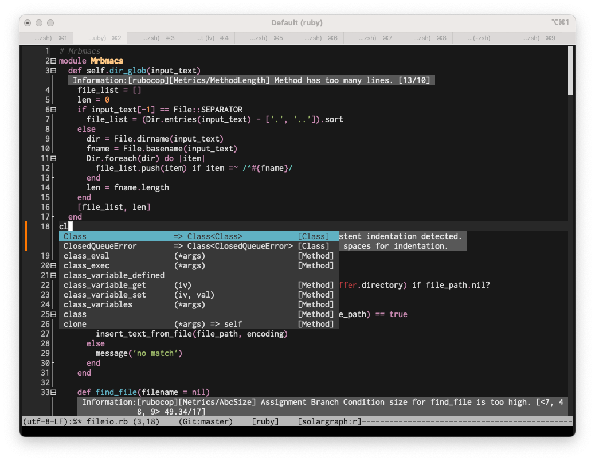
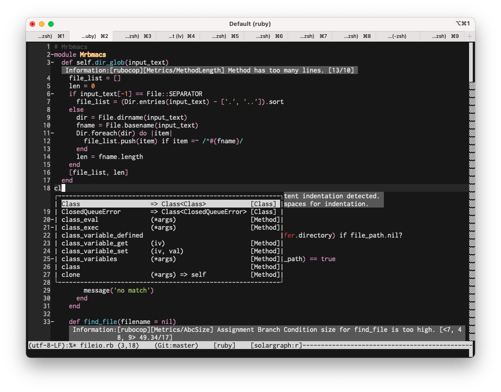
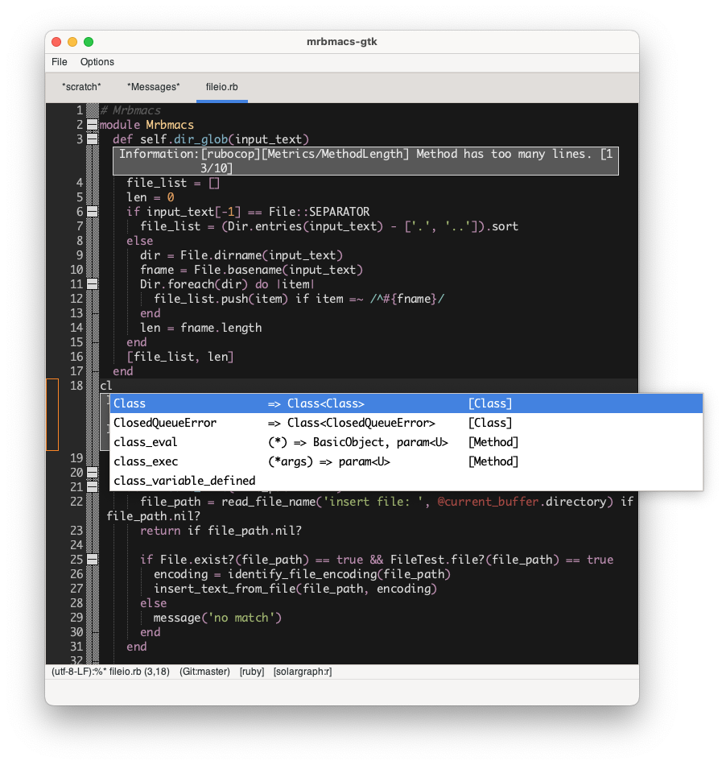

# mrbmacs

mrbmacs is a lightweight text editor with an Emacs-like interface.
It adopts the Scintilla framework for efficient code editing and enhanced syntax highlighting, augmented by the customizability of mruby scripting extensions.

# Screenshots

### Termbox

### Curses

### GTK

