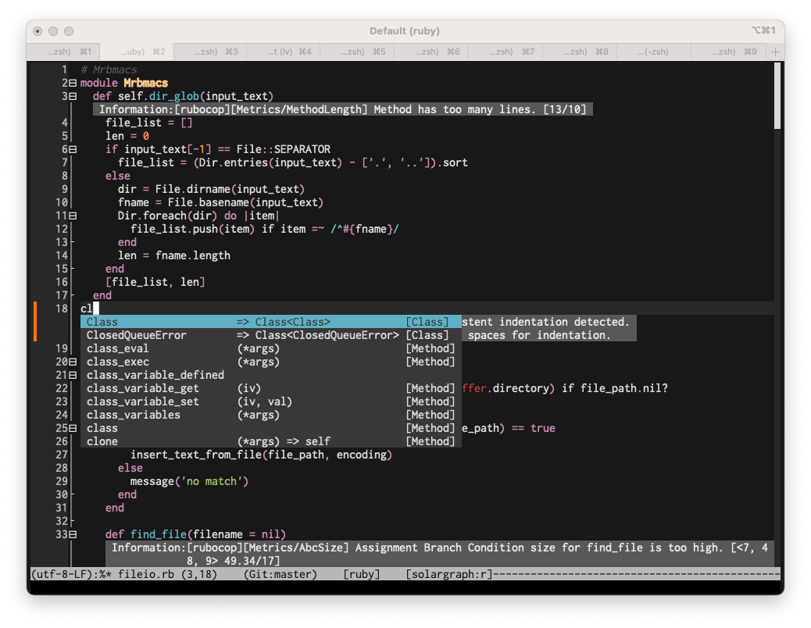
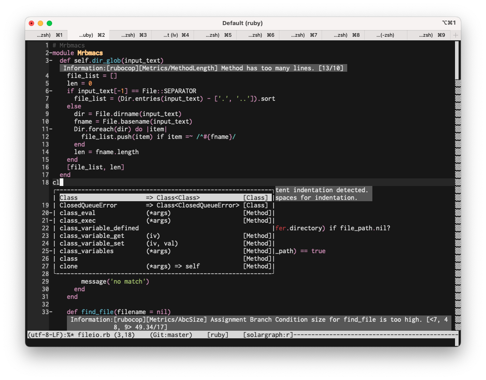
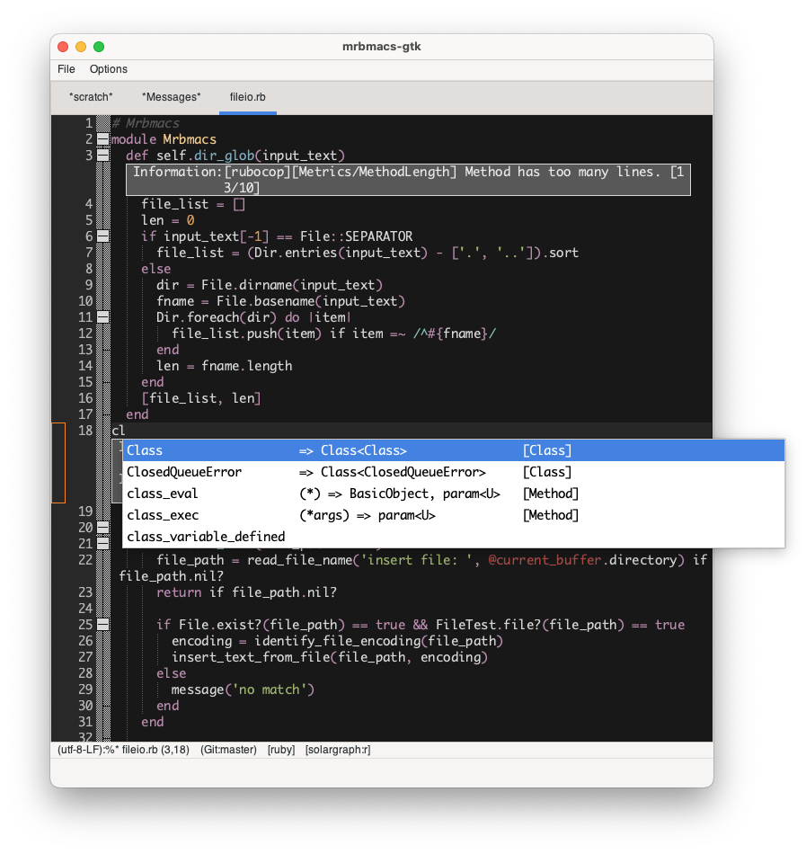

# mrbmacs

mrbmacs is a lightweight text editor with an Emacs-like interface.
It adopts the Scintilla framework for efficient code editing and enhanced syntax highlighting, augmented by the customizability of mruby scripting extensions.

Mrbmacs can operate across different UI frameworks, allowing you to choose the
interface that fits your environment.

## Frontends

- [Termbox](https://github.com/masahino/mruby-bin-mrbmacs-termbox)
- [Curses](https://github.com/masahino/mruby-bin-mrbmacs-curses)
- [GTK](https://github.com/masahino/mruby-bin-mrbmacs-gtk)
- [Cocoa](https://github.com/masahino/mruby-bin-mrbmacs-cocoa) (native macOS)

The frontend repositories contain platform-specific requirements and build
instructions. Common features and startup configuration are documented here.

## Screenshots

### Termbox


### Curses


### GTK


## Getting started

The default build includes Termbox, Curses, and GTK. Running the build without
a frontend name builds all three configurations. Select Cocoa explicitly on
macOS.

```
$ git clone https://github.com/masahino/mrbmacs
$ cd mrbmacs
$ ./build.sh
$ ./build.sh curses
$ ./build.sh gtk
$ ./build.sh cocoa
```

See [Building mrbmacs](docs/building.md) for details. Cocoa requires macOS.

## Documentation

- [Startup configuration](docs/configuration.md)
- [Editor margins](docs/margins.md)
- [Language Server Protocol (LSP)](docs/lsp.md)
- [Debug Adapter Protocol (DAP)](docs/dap.md)
- [Version control](docs/version-control.md)
- [Building mrbmacs](docs/building.md)
